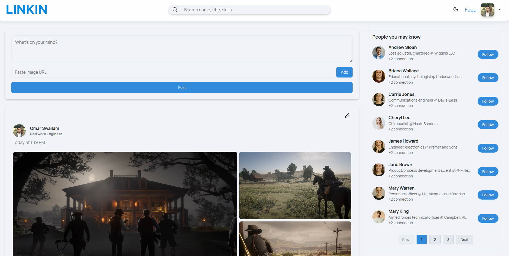

# LINKIN

## Project Overview



A fully functional LinkedIn-style social media frontend built with React, TypeScript, TanStack Query, and TanStack Router. This app connects to a Flask + Neo4j backend and supports real-world features like following users, posting updates, and viewing connection degrees.

[Backend repo](https://github.com/OmarSwailam/social-media-neo4j-flask)

## Features

- User authentication (login/signup)
- Follow/unfollow users  
- See your feed and post updates  
- Comment, reply, and like posts  
- Search users by name, job title, or acquired skills  
- View connection degrees like +1, +2, +3 (just like LinkedIn)  
- Light and Dark theme

---

## Installation

### Using Docker

Make sure you have Docker installed on your machine.

1. Clone this repository to your local machine:
  ```bash
  git clone https://github.com/OmarSwailam/linkin.git
  ```

2. Navigate to the project directory
  ```bash
  cd linkin
  ```

3. Build and run the container:
  ```bash
  docker build -t linkin-frontend .
  docker run -p 3000:80 linkin-frontend
  ```

4. Open your browser and go to: http://localhost:3000

**Make sure the backend is running at http://localhost:5000**

### Normal installation


1. Clone this repository to your local machine:
  ```bash
  git clone https://github.com/OmarSwailam/linkin.git
  ```

2. Navigate to the project directory
  ```bash
  cd linkin
  ```

3. Install dependencies using pnpm:
  ```bash
  pnpm install
  ```
4. Start the development server:
  ```bash
  pnpm run dev
  ```

4. Open your browser and go to: http://localhost:5173

**Make sure the backend is running at http://localhost:5000**


## Contributing

Contributions are welcome! You can contribute to the project by:

- Reporting issues or suggesting improvements.
- Forking the repository and submitting pull requests.


Author: Omar Swailam